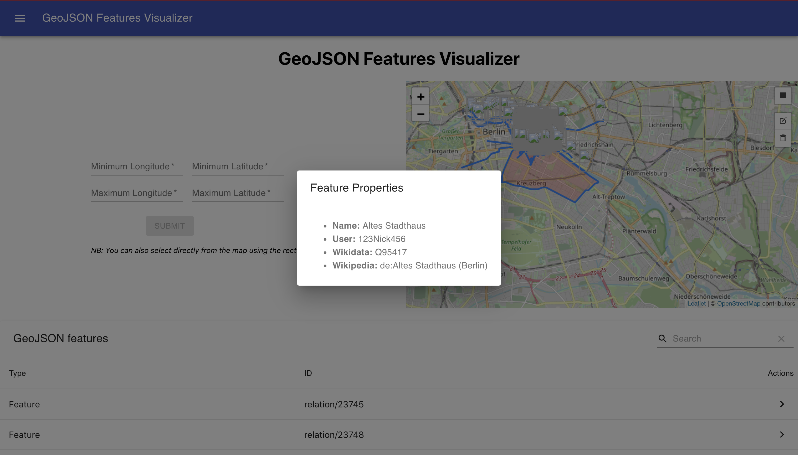
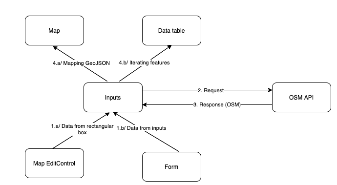

# GeoJSON Project
The main goal of this project is to properly visualize GeoJSON data from openstreetmap API.
### 1.Data source:
Through this project, we used the OpenStreetMap Map API, consisting on giving a bounding box as input, containing 4 main corners:
* Minimum longitude
* Minimum latitude
* Maximum longitude
* Maximum latitude
The API returns an OSM object containing all the features needed. These features are then processed and transformed to a GeoJSON format, in order to be displayed in the screen.
### 2. Input retrieval:
The input retrieval was made using two methods:
* The first method is through a form with 4 inputs.
* The second method is through drawing a rectangle on a displayed map.

### 3. Display of features:
The display of the features was made using two main frames:
* A datatable containing the features, each row with its details in a modal.
* A map, processing the GeoJSON output and displaying it directly.
The output is shown as the following:

All these can be described in the diagram down below:

### 4. Implementation
The app was implemented using ReactJS as a main library, and JavaScript as a programming language. The main components of the platform are shown in the following diagram:
