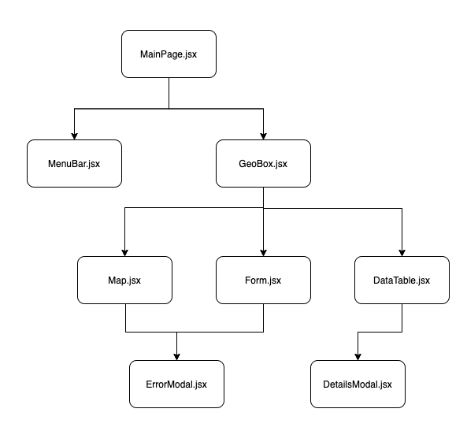

# GeoJSON Project
The main goal of this project is to properly visualize GeoJSON data from openstreetmap API.
### 1.Data source
Through this project, we used the OpenStreetMap Map API, consisting on giving a bounding box as input, containing 4 main corners:
* Minimum longitude
* Minimum latitude
* Maximum longitude
* Maximum latitude

The API returns an OSM object containing all the features needed. These features are then processed and transformed to a GeoJSON format, in order to be displayed in the screen.
### 2. Input retrieval
The input retrieval was made using two methods:
* The first method is through a form with 4 inputs.
* The second method is through drawing a rectangle on a displayed map.

### 3. Display of features
The display of the features was made using two main frames:
* A datatable containing the features, each row with its details in a modal.
* A map, processing the GeoJSON output and displaying it directly.
<br />
The output is shown as the following:


<br />
All these can be described in the diagram down below:


<br />
### 4. Implementation
The app was implemented using ReactJS as a main library, and JavaScript as a programming language. The main components of the platform are shown in the following diagram:



Each file contains a specific component, and describes a certain behaviour in the app. The files contain few comments if needed.

### 5. Data validation
The validation of the data was made through the form as following:
* The numbers should be between -180 and 180.
* If an input is missing, the submit button is disabled.
* If the size of the bounding box exceeds 0.25, a popup appears.
The validation of the data was made through the map as following:
* If the size of the bounding box exceeds 0.25, a popup appears.

### 6. Unit testing
Unit testing was made using the Jest and React-testing libraries in ReactJS. It was mainly about the form inputs, and the rendering of different components.

### 7. Future perspectives
Due to tight schedules, we couldn't achieve as much as possible in this project. Thus, the plan is to add the following:
* Loading bars while the API is waiting for a response, to make the user experience better.
* More unit testing in different features.
* Improving the user interface to match certain standards. 

### 8. Project commands:
1. Running the project:
```console
macos@iyadh:~$ yarn install
```
```console
macos@iyadh:~$ yarn start
```
2. Testing:
```console
macos@iyadh:~$ yarn test
```